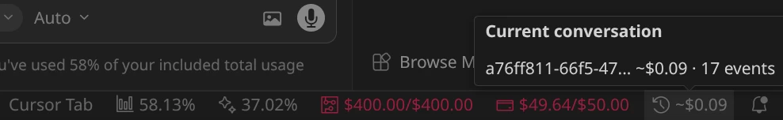
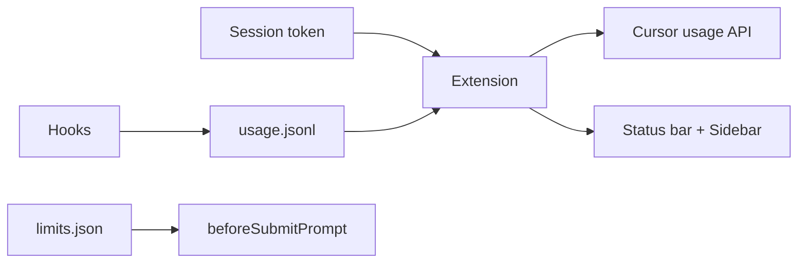

**Cursor Usage Wizard** shows your Cursor usage and estimated cost in the status bar, tracks usage per conversation (Agent + Tab), and lets you set per-conversation limits so you stay in control of spend.

> **⚠️ Disclaimer:** The Cursor session token (cookie) is sensitive—**never share it or commit it anywhere** (repos, screenshots, logs, etc.). This extension is provided **as-is; use at your own risk**. The authors are not responsible for any misuse, data exposure, or account issues arising from use of this extension.

## 🚀 Quick start

1. **Install** the extension from [Open VSX](https://open-vsx.org/extension/bitbrain/cursor-usage-wizard) (Cursor) or [VS Code Marketplace](https://marketplace.visualstudio.com/items?itemName=bitbrain.cursor-usage-wizard).
2. **Set your session token**: run **Cursor Usage Wizard: Set Session Token** and paste your `WorkosCursorSessionToken` from [cursor.com](https://cursor.com) (DevTools → Application → Cookies).
3. Usage appears in the **status bar**; open **Cursor Usage** in the sidebar for per-conversation breakdown and limits.

## ✨ Features

### 📊 Status bar

Total premium usage and breakdown at a glance: total usage %, auto-complete %, API pool, and on-demand usage. When available, the active (or latest) conversation’s estimated cost is shown (e.g. `~$0.42`). Background color warns at 75% and 90% usage. Hover any item for a detailed tooltip.

### 💬 Per-conversation tracking

Event counts and estimated cost per conversation, with **Agent** (Cmd+K) and **Tab** (inline) usage tracked via Cursor hooks. The sidebar view **Cursor Usage → By conversation** lists all conversations with cost, event count, and source; **Details** shows a single conversation. Live tracking updates the list and detail view as you use Cursor.

### 🛡️ Per-conversation limits

Set a cost or event limit per conversation. Cost and event limits are both set from the same **Set Conversation Limit** flow (command palette or context menu). When the limit is exceeded, the `beforeSubmitPrompt` hook blocks further prompts until you change or clear the limit. Set limits from the command palette or via **Set cost limit for this conversation** in the conversation tree context menu.

### 💰 Cost estimation

Lightweight model lookup table (no token counting). Plan-aware when the API exposes it, or set your tier with `cursorUsageWizard.planOverride` (`free`, `pro`, `pro_plus`, `ultra`).

## 📦 Installation

1. Install from [Open VSX](https://open-vsx.org/extension/bitbrain/cursor-usage-wizard) (Cursor) or [VS Code Marketplace](https://marketplace.visualstudio.com/items?itemName=bitbrain.cursor-usage-wizard).
2. Or install from VSIX: `code --install-extension cursor-usage-wizard-0.2.1.vsix`

On first activation, the extension installs hooks into `~/.cursor/hooks.json` and copies scripts to `~/.cursor/usage-wizard/`.

**🔑 Authentication:** Run **Cursor Usage Wizard: Set Session Token** and paste your `WorkosCursorSessionToken` cookie from [cursor.com](https://cursor.com) (DevTools → Application → Cookies). The token is stored in VS Code’s secret storage and is used only to request usage from Cursor’s API.

## ⚙️ How it works

1. **Extension** uses your session token (from the Set Session Token command) to fetch usage from Cursor’s API.
2. **Hooks** (in `~/.cursor/hooks.json`) append events to `~/.cursor/usage-wizard/usage.jsonl`.
3. **Cost estimation** uses a simple model lookup table (no token parsing).
4. **Limits** are stored in `~/.cursor/usage-wizard/limits.json` and enforced by the `beforeSubmitPrompt` hook.

**🔒 Privacy:** Your session token is stored in VS Code’s secret storage and used only to request usage from Cursor’s API. The extension does not send data elsewhere and does not use telemetry.

## ⌨️ Commands

| Command | Description |
|--------|-------------|
| **Cursor Usage Wizard: Set Session Token** | Paste session cookie to enable usage fetching |
| **Cursor Usage Wizard: Clear Session Token** | Remove stored token |
| **Cursor Usage Wizard: Show Usage** | Refresh and show usage |
| **Cursor Usage Wizard: Show Conversations** | Open sidebar and list conversations with usage and limits |
| **Cursor Usage Wizard: Set Conversation Limit** | Set limit for a conversation |
| **Cursor Usage Wizard: Refresh Stats** | Manual refresh of status bar and data |
| **Set cost limit for this conversation** | Context menu on a conversation in the tree |

## ⚙️ Configuration

| Setting | Default | Description |
|---------|---------|-------------|
| `cursorUsageWizard.refreshInterval` | `30` | How often to refresh stats (seconds). Minimum 5. |
| `cursorUsageWizard.showPerConversationInStatusBar` | `false` | Show per-conversation count in status bar |
| `cursorUsageWizard.showLatestInStatusBar` | `true` | Show active or latest conversation cost in status bar |
| `cursorUsageWizard.usageStorePath` | `""` | Override usage store path; empty = `~/.cursor/usage-wizard/` |
| `cursorUsageWizard.planOverride` | `"auto"` | Plan tier when API doesn’t expose it: `auto` \| `free` \| `pro` \| `pro_plus` \| `ultra` |
| `cursorUsageWizard.liveTrackingEnabled` | `true` | Watch `usage.jsonl` and refresh conversation list and detail view live |

## 🔧 Troubleshooting

**"Unable to fetch"** — Open **View → Output**, choose **Cursor Usage Wizard**. The log shows each request (URL, status, content-type, body length and preview) so you can see whether the dashboard returns 200, a redirect, or HTML and why parsing might fail.

**Wrong or missing usage** — If your plan isn’t detected, set `cursorUsageWizard.planOverride` to your tier: `free`, `pro`, `pro_plus`, or `ultra`.

**Token expired** — Re-run **Cursor Usage Wizard: Set Session Token** with a fresh cookie from [cursor.com](https://cursor.com) (DevTools → Application → Cookies).

## Releasing

**Extension CI** runs on every push and pull request (compile + `vsce package` to validate the extension). **Extension Release** runs only when you push a tag (e.g. `v0.3.0`) and publishes to both **Open VSX** (so Cursor can find the extension) and the **VS Code Marketplace**. Ensure `package.json` version matches the tag.

Required repository secrets:

- **`VS_MARKETPLACE_TOKEN`** — Azure DevOps PAT with Marketplace → Manage scope (for Visual Studio Marketplace).
- **`OPEN_VSX_TOKEN`** — Open VSX access token (for Cursor / Open VSX). Create at [open-vsx.org](https://open-vsx.org); one-time namespace: `npx ovsx create-namespace bitbrain -p <token>`.

## 📄 License

MIT

---

**🔗 Source:** [github.com/bitbrain/cursor-usage-wizard](https://github.com/bitbrain/cursor-usage-wizard)
